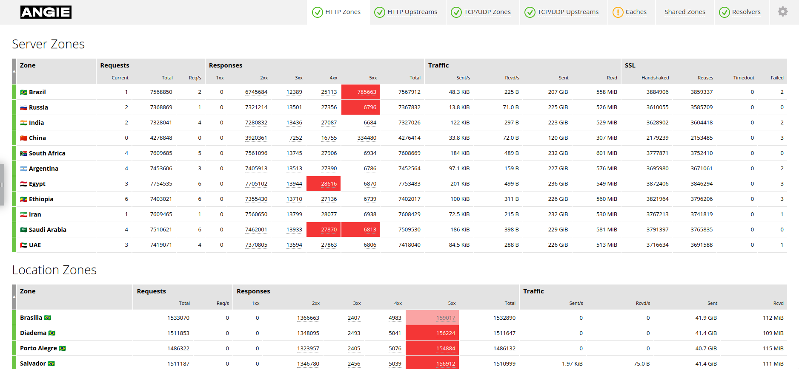

<div align="center">
    
</div>

<h1 align="center">Angie Console Light</h1>
<p align="center">Live activity monitoring tool for Angie.</p>

<h4 align="center">
  <a href="https://angie.software/en/console/#introduction">Introduction</a>
  ·
  <a href="https://angie.software/en/console/#installation-and-configuration">Installation and configuration</a>
  ·
  <a href="https://angie.software/en/console/">Documentation</a>
  ·
  <a href="https://angie.software/en/">Website</a>
</h4>


## Preview




## Development

Make sure all dependencies are installed:

```bash
yarn install
```

If your API prefix is not ``/api``,
change it in the ``src/constants.js`` file.

By default, the development configuration uses
https://console.angie.software
for the API server.
Set the *PROXY_TARGET* environment variable
to use a custom server for development:

```bash
PROXY_TARGET=%YOUR_ANGIE_SERVER% yarn run start-dev
```


Finally, open
http://localhost:8082
in the browser.


### Testing

We use [Jest](https://jestjs.io/) for testing.
To separate the tests from other source code,
all test files are placed under ``__test__``.

Run tests:

```bash
yarn test
```


### Building

Make sure all dependencies are installed:

```bash
yarn install
```

Build the project:
```
yarn build
```

The result will appear under ``dist/console``.


### Publishing

Publish the newly built ``dist/console`` directory
on your server
and follow
[our guide](https://angie.software/en/console/#installation-and-configuration)
to configure Angie.
